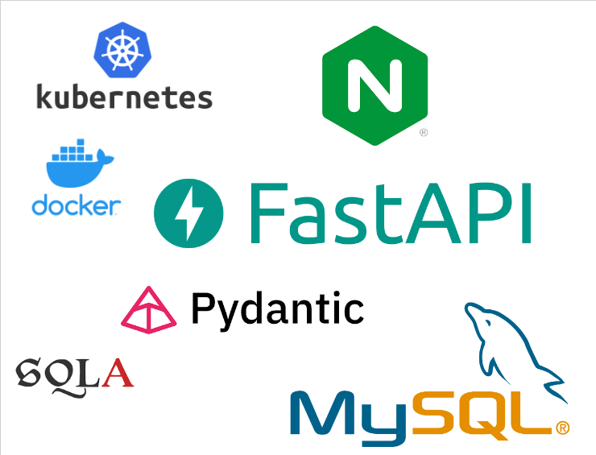
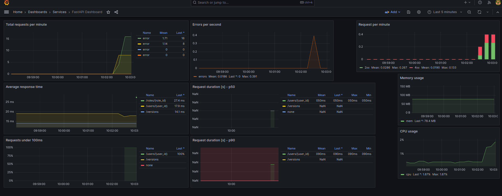

# fastapi-example-app


## Purpose

This FastAPI application serves as a reference architecture, showcasing best practices and a clean structure for building web APIs. It is designed to assist in creating a new API from scratch and understanding the key aspects of a backend architecture. The backend API provides two primary resources: Users and Items, with data storage in a MySQL database.

The application adheres to recommended guidelines and incorporates essential features for production use, such as authentication, versioning, permissions, crons, serving static files, logging, documentation, and monitoring (see [Features](#Features])).

You can launch this project in the following ways:
- [Locally](#local-setup-standalone)
- [Through docker containers](#local-setup-docker-compose)
- [Through Kubernetes](#production-deployment)


## Summary
- [Key Concepts](#key-concepts)
- [Architecture](#architecture)
- [Database](#database-schema)
- [Features](#features)
  - [1. Versioning](#Versioning)
  - [2. Authentication](#Authentication)
  - [3. Permissions](#Permissions)
  - [4. Crons](#Crons)
  - [5. Serve static files ](##serve-static-files)
  - [6. Logging](#Logging)
  - [7. Documentation](#Documentation)
  - [8. Monitoring](#Monitoring)
- [Postman collection](#postman-collection)
- [Installation](#installation)
  - [Standalone app](#local-setup-standalone)
  - [Containerized (Docker)](#local-setup-docker-compose)
  - [Production Deployment (Kubernetes)](#production-deployment)


## Key Concepts

#### Topics
- Backend development
- DevOps
- Monitoring

### Technologies
- [FastAPI (Python)](https://fastapi.tiangolo.com/)
- [MySQL](https://www.mysql.com)
- [Prometheus](https://prometheus.io/)
- [Grafana](https://grafana.com/)
- [Nginx](https://www.nginx.com/)
- [Docker](https://www.docker.com/)
- [Docker-Compose](https://docs.docker.com/compose/)
- [Kubernetes](https://kubernetes.io)

## Architecture

```
├── app
    ├── api       => Controllers for defining HTTP routes for resources and handling errors
    ├── cron      => Background tasks definition
    ├── crud      => CRUD operations for each resource (no error handling)
    ├── db        => Database connection management
    ├── exceptions => Custom exceptions
    ├── models    => Serialization of resources from the database schema into classes
    ├── repository => Middleware for communication between api/controllers and other CRUD operations
    ├── schemas   => Mapping of input/output HTTP payloads
    ├── static    => Serving static files
    ├── test      => For testing
    ├── utils     => Utilities and common functions/constants used across other folders
    ├── .env      => Environment variables for local usage
    ├── .env.docker-compose  => Environment variables for Docker container usage
    ├── main.py   => Entry point, route import, cron job definition, auto-documentation generation, and app initialization
    ├── settings.py => Mapping of environment variables from .env file to class attributes
    ├── requirements.txt => List of dependencies
```

### Database schema
The database schema in this example is straightforward, with two primary resources: Users and Items. Users can create, update, retrieve, and delete items. Other tables are less relevant from a project perspective:

- Tokens table stores tokens for user authentication (see [Authentication](#Authentication)
- Roles table stores a static list of roles, each mapped to an ID (see [Permissions](#Permissions)
- Versions table stores each version as a string and includes a boolean flag to specify if the version is supported (see [Versioning](#Versioning)


For example, you can perform actions like:
- Create a new user
- Create an item
- Update a user
- Delete an item
- And more...

## Features
This application showcases various features that are crucial for production-ready APIs.
- [1. Versioning](#Versioning)
- [2. Authentication](#Authentication)
- [3. Permissions](#Permissions)
- [4. Crons](#Crons)
- [5. Serve static files ](##serve-static-files)
- [6. Logging](#Logging)
- [7. Documentation](#Documentation)
- [8. Monitoring](#Monitoring)

### 1. Versioning
Versioning is implemented using an X-Version HTTP header and is handled through a decorator @custom_declarators.version_check. This function checks for the presence of the X-Version HTTP header and compares it with the content of the versions table. Each version can be either supported or not. The absence of the header is considered equivalent to a supported version.

- If `version.supported=True` or if version is not sent in HTTP header => Allow to continue executing the given route
- If `version.supported=False` => Raise a HTTP 426 error

<details><summary>Example of supported/non-supported versions</summary>


```bash
# A non-supported version
➭ VERSION=0.9; curl -sSw "\nstatus_code: "%{http_code} http://localhost:8080/roles -H "X-Version: ${VERSION}"
{"detail":"Version not supported anymore"}
status_code: 426
```

```bash
# A supported version        
➭ VERSION=1.0; curl -sSw "\nstatus_code: "%{http_code} http://localhost:8080/roles -H "X-Version: ${VERSION}"
[{"name":"admin","id":1},{"name":"user","id":2}]
status_code: 200
```

</details>

### 2. Authentication


#### Tokens
This application incorporates an OAuth2 authentication mechanism using two types of tokens:

- **access_token**: This token is temporary and has a limited lifespan, typically a few hours. It is required for every route that demands a user to be authenticated.
- **refresh_token**:  In contrast, the refresh token is long-lasting, persisting for several months. It serves the purpose of obtaining a new access_token.

The goal of this mechanism is to minimize the frequency with which a user needs to enter their password while still allowing them to remain logged in.

Here's how it functions:
1. **User Login**: To log in, a user provides their password via a `POST /auth/token` request. In response, the API returns both an `access_token` and a `refresh_token`
2. **Token Storage**: The user's frontend application securely stores these credentials in its local cache.
3. **Authenticated Requests*: As the user navigates the application and makes requests to the API, they include the `access_token` in the HTTP Authorization header using the Bearer token mechanism.
4. **Token Validation**: The API examines this HTTP header for every route to ensure the user is authenticated and has the necessary access permissions.
5. **Token Expiry Check**: The API also checks the validity of the `access_token` provided in the header. If the `access_token` has expired, the API responds with a HTTP 401 (Unauthorized) status code.
6. **Token Refresh**: If the user's `access_token` has expired, they can send a `POST /auth/refresh` request, providing their `refresh_token` in the request payload
7. **Token Regeneration**: The API parses the `refresh_token` to verify its association with a known user in the database's tokens table. If the token is valid, the API generates a new set of `access_token` and `refresh_token` for the user.


Utilizing tokens in this manner allows the application to avoid the need to transmit the user's password in HTTP requests, which reduces the risk of sensitive information interception, such as man-in-the-middle attacks, Wi-Fi spoofing, and exposure over non-secure connections.

The two types of tokens, access_token and refresh_token, are randomly generated strings composed of characters and digits. By default, they have a length of 128 characters. This length can be adjusted in the `utils/consts.py` file.


#### Multi-device logging

You may have noticed we use a `tokens` table in database instead of new dimensions in the `Users` table.

Adding all the `tokens` fields in the `Users` table would have worked fine but it prevents the app to store several tokens for the same user.

If the app is designed to be released on several devices (iOS/Android/Web...), this limitation can harm users preventing them to be logged in through several devices at the same time.

Using a `tokens` table, we keep this **one-to-many** relationship between Users and Tokens.


#### Password Security

To ensure user password security, the application employs a robust security strategy. Here's how it's achieved:

- User passwords are never stored in plain text in the database. This practice avoids exposing users' sensitive information in the event of a data breach.
- Passwords are hashed on the backend, and plain text passwords are never transmitted between the backend and the database.
- The hashed password is stored in the `hashed_password` column of the Users table.

However, there's a potential security issue that arises when multiple users employ the same password. In such cases, they would have the same hashed password in the database. This situation could be exploited by attackers in the event of a database breach.

To mitigate this risk, the application introduces an additional layer of security: a `salt`. This unique random string, known as a salt, is used as a seed during user creation. It ensures that the hashed password cannot be decrypted without the corresponding salt. Each user's salt is unique, preventing different users with the same password from having the same hashed password.

At the backend level, password operations proceed as follows:

- When a user logs in via a `POST /auth/token` request and sends their password in the request payload, the API fetches the `hashed_password` and the `salt` from the database. It then decrypts the `hashed_password` (using the `salt` as well) and compares it with the plain text password sent in the HTTP request.
- When creating or updating a user, the password is encrypted, and the resulting `hashed_password` is stored in the database.

An additional layer of security is introduced through the `SECRET_KEY` in the `utils/consts.py` file. This secret key is used in combination with the `hashed_password` and `salt` to encrypt and decrypt passwords. Even in the event of a database breach, this secret key remains concealed from attackers, making it nearly impossible for them to reverse-engineer the decryption method used for the hashed passwords.


All auth parameters/variables are stored in `utils/consts.py` and can be adjusted to your need.

### 3. Permissions
Users are associated with a role, which defines their permissions. There are currently two roles in database:

<details><summary>Roles</summary>

```bash
curl -sS http://localhost:8080/roles | jq .
[
  {
    "name": "admin",
    "id": 1
  },
  {
    "name": "user",
    "id": 2
  }
]
```

</details>

Roles are the key element which defines permissions. Here are the following 4 different permissions currently handled, and their signification.
- `PERMISSION_ADMIN`: Admin account
- `PERMISSION_ADMIN_OR_USER_OWNER` => `role_id=1 or role_id=2 and user_id=current_user.id`: For routes with a user_id parameter in the path, allowing access to admin or the user matching the `user_id`.
- `PERMISSION_ADMIN_OR_ITEM_OWNER` For routes with an item_id parameter in the path, allowing access to admin or the user who owns the item matching the `item_id`.
- `PERMISSION_USER` : Any authenticated user.

Permission are defined through a custom decorator for each route:

```python
@custom_declarators.permission(permission_string=consts.Consts.PERMISSION_ADMIN)
def create_user_as_admin(user: user_schema.UserCreate, request: Request, db: Session = Depends(get_db)):
  ...
```

<details><summary>The declarator itself is defined here</summary>

```python
def permission(permission_string):
    def decorator_auth(func):
        @wraps(func)
        def wrapper(*args, **kwargs):
            request = kwargs['request']
            db = kwargs['db']
            token = rights.retrieve_token_from_header(request)
            if permission_string == consts.Consts.PERMISSION_ADMIN:
                rights.is_admin(db, token)
            elif permission_string == consts.Consts.PERMISSION_ADMIN_OR_USER_OWNER:
                user_id = kwargs['user_id']
                rights.is_admin_or_user_owner(db=db, token=token, user_id=user_id)
            elif permission_string == consts.Consts.PERMISSION_ADMIN_OR_ITEM_OWNER:
                item_id = kwargs['item_id']
                rights.is_admin_or_item_owner(db=db, token=token, item_id=item_id)
            elif permission_string == consts.Consts.PERMISSION_USER:
                rights.is_authenticated(db=db, token=token)
            return func(*args, **kwargs)
        return wrapper
    return decorator_auth
```

</details>

Functions defined in `rights.py` will trigger a HTTP 403 error if the current user doesn't have the given permission.
Therefore, you can protect any route with any level of permission through this decorator

### 4. Crons
Cron can be configured using the [BackgroundScheduler module](https://fastapi.tiangolo.com/tutorial/background-tasks/).

They are defined easily using a decorator

<details><summary>Sample code for cron configuration</summary>

```python
# This cron will run at an interval of 1 day (everyday) and will:
# - Open a connection to the database
# - Fetch expired access_token (where access_token_expiration<now) and delete them
# - Close the connection to the database. Closing the connection in the end is important to not leave open conections waiting forever and wasting the pool of connections defined in the database configuration
@sched.scheduled_job('interval', days=1)
def delete_expired_tokens():
    db = SessionLocal()
    db_tokens = token_crud.delete_expired_tokens(db=db)
    logger.info(f"Tokens: Expired tokens deleted: {db_tokens}")
    db.close()
```

You then call `sched.start()` to start the cron

You should observe such logs when you start the app. This means the cron job is currently running
```
2023-10-17 19:40:27,831 [INFO] Added job "delete_expired_tokens" to job store "default"
2023-10-17 19:40:27,831 [INFO] Scheduler started
```

</details>


### 5. Serve static files
We can configure the FastAPI app to serve static files using the following command

```python
app.mount("/", StaticFiles(directory="static/files/"))
```

This maps files under `static/files/` folder at the root level of the web server (`/`). `static/files/logo.png` could be fetched from `http://localhost:8080/logo.png`


### 6. Logging
Logging is implemented using the standard Python logging library. The logging configuration is defined in `main.py`. Logs are used to record informational, warning, and error messages.

<details><summary>Sample code for logging</summary>

  ```python
  import logging
  logging.basicConfig(
      level=logging.INFO,
      format="%(asctime)s [%(levelname)s] %(message)s"
  )

  logger = logging.getLogger()
  # Print something
  logging.info("A simple message")
  logging.warning("A warning message")
  logging.error("An error message")
  ```

  ```
  2023-10-20 11:00:37,526 [INFO] A simple message
  2023-10-20 11:00:37,526 [WARNING] A warning message
  2023-10-20 11:00:37,526 [ERROR] An error message
  ```
</details>

### 7. Documentation
One of the great features of FastAPI is the [automatic generation of API documentation](https://fastapi.tiangolo.com/tutorial/metadata/). It supports two documentation interfaces: Swagger and Redoc. In this example, we use Redoc.

First of all we need to define the openapi.json endpoint which will then be used to generate the Redoc documentation. We generate the endpoint /openai.json, which will return the OpenAPI schema in a JSON format. This function uses HTTPBasicCredentials and therefore documentation route can be protected with username/password authentication.

<details><summary>Sample code for documentation</summary>

```python
# Docs
@app.get("/openapi.json", include_in_schema=False)
async def get_open_api_endpoint(credentials: HTTPBasicCredentials = Depends(security), db: Session = Depends(get_db)):
    openapi_schema = get_openapi(
        title="Sample API Documentation",
        version="1.0.0",
        routes=app.routes,
        description="Postman Collection: https://api.postman.com/collections/1999344-93e21dc5-aa22-4fbf-a196-fcb5e5f1926c?access_key=PMAT-01HCWNW2JZVWXF79N5ESXY61TT",
        openapi_version="3.0.3",
    )

    openapi_schema["info"]["x-logo"] = {
        "url": "/logo.png"
    }
    app.openapi_schema = openapi_schema
    return JSONResponse(openapi_schema)
```

</details>

In the following block of code, from main.py, we generate the Redoc documentation from the OpenAPI JSON documentation endpoint we previously configured, /openapi.json. We serve it on /docs route.
```python
@app.get("/docs", include_in_schema=False)
async def get_documentation(credentials: HTTPBasicCredentials = Depends(security), db: Session = Depends(get_db)):
  ...
  return get_redoc_html(openapi_url="/openapi.json", title="docs")
```

The documentation can be accessed on [localhost:8080/docs](localhost:8080/docs) and is generated from the signature of the APIRouter fonctions (under /api folder). There is by default a single user in the database sample: username: *admin* / password: *admin*

```python
@router.post("/items", response_model=item_schema.ItemResponse, status_code=201, responses=get_responses([201, 401, 403, 409, 422, 426, 500]), tags=["Items"], description="Create an Item object. Permission=User")
```

### 8. Monitoring

This app example contains also a prometheus exporter (see https://github.com/trallnag/prometheus-fastapi-instrumentator) to expose default metrics (no custom metric here).

The endpoint is available at [http://localhost:8000/metrics](http://localhost:8000/metrics) and exposes an endpoint that can be fetched regularly from a [Prometheus](https://prometheus.io/) instance to monitor the app.

Visualization can be performed through [Grafana](https://grafana.com/)


Dashboard coming from https://github.com/Kludex/fastapi-prometheus-grafana

Grafana default credentials are: *admin*/*admin*

See [Containerized (Docker)](#local-setup-docker-compose) below to insall Prometheus/Grafana through docker-compose

## Postman collection

Postman collection available here: [here](https://api.postman.com/collections/1999344-93e21dc5-aa22-4fbf-a196-fcb5e5f1926c?access_key=PMAT-01HCWNW2JZVWXF79N5ESXY61TT)

## Installation

- [Standalone app](#local-setup-standalone)
- [Containerized (Docker)](#local-setup-docker-compose)
- [Production Deployment (Kubernetes)](#production-deployment)

### Local setup standalone

Ensure you have a mysql server installed and initialise the database by executing those 3 SQL scripts.
Default configuration: user: *test*, database name: *test*, password: *test*

```
mysql -u root < database/base/01_init_db.sql
mysql -u root < database/base/02_schema.sql
mysql -u root < database/base/03_data.sql
```

```bash
pip3 install -r requirements.txt
```

If you are using different MySQL credentials, please edit the `.env` file accordingly. This file is used to pass sensitive database connection information to the API.

```bash
python3 main.py
```

### Local setup docker-compose

MySQL and FastAPI app are containerized and provided in the `docker-compose.yml` file.
FastAPI app docker image is built from `app/Dockerfile` (specified in the `docker-compose.yml` file)

The .env file used in this case is `.env.docker-compose`. It differs by the fast the DB_HOST is not `localhost` anymore as MySQL server and FastAPI run in two distinct containers now.

Port 3306 of MySQL and port 8080 (API) and 8000 (monitoring) are not exposed to outside each container. To reach the API we use a third component: An Nginx reverse proxy. Requests will be sent towards the nginx gateway.

There are also two other containers for monitoring: Prometheus and Grafana.


The idea is to expose only port 8080 of Nginx and redirect routes based on their path to the appopriate location.


- `^/auth|docs|openapi.json|items|users|roles|versions` ➜ routed to API container port 8080
- `^/metrics` ➜ routed to API container port 8000
- `^/prometheus` ➜ routed to Prometheus container port 9090
- `^/grafana` ➜ routed to Grafana container port 3306

See nginx configuration below:

<details><summary>Nginx configuration</summary>

```
http {
    server {
        listen 8080 default_server;

        # set DNS resolver as Docker internal DNS
        resolver 127.0.0.11 valid=10s;
        resolver_timeout 5s;

        location ~ ^/(auth|docs|openapi.json|items|users|roles|versions) {
            proxy_pass http://fastapi-example:8080;
        }

        location /metrics {
            proxy_pass http://fastapi-example:8000;
        }

        location /prometheus/ {
            proxy_pass http://prometheus:9090;
        }

        location /grafana/ {
            proxy_set_header Host grafana;
            proxy_set_header Origin https://grafana:3000;
            proxy_pass http://grafana:3000;
        }
    }
}

```
</details>

To launch everything (MySQL, FastAPI, Nginx, Prometheus and Grafana), just run the following command:

```bash
docker-compose up
```

And fetch any resource from port 8080: [localhost:8080/grafana](http://localhost:8080/grafana), [localhost:8080/users](http://localhost:8080/users), [localhost:8080/metrics](http://localhost:8080/metrics), [localhost:8080/prometheus](http://localhost:8080/prometheus), ...


### Production deployment
TODO
